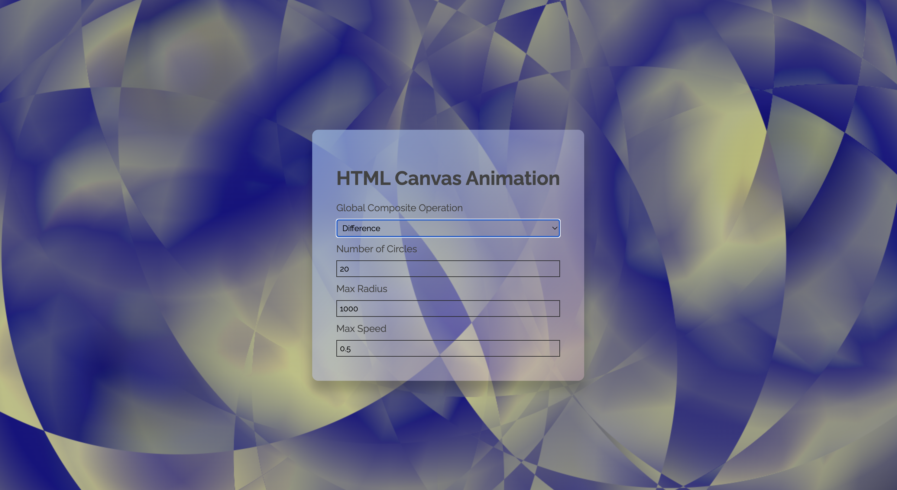

# General Background Animation

The purpose of this project was to really get to grips with HTML Canvas and explore the impact of different settings. Furthermore, it was about creating a basic template that could be reused and modified in the future to create dramatic variations with minimal altering of code.

Simple DOM manipulation was used to alter the animation properties via the browser.

An OOP approach was used to create an array of circles with a variety of properties such as location, size, and speed. A bounce method was integrated to ensure that the circles are contained within the screen.

The project could still be expanded. Something that is yet to be implemented is allowing the user to select the number of colours each circle is comprised of, as well as selecting the colours themselves.
